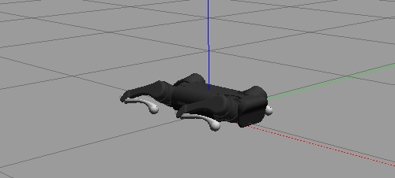
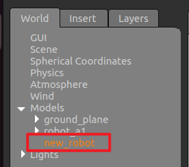

- [model-predictive-control](#model-predictive-control)
  - [运行示例程序](#运行示例程序)
  - [quadruped](#quadruped)
    - [quadruped 对控制指令的生成](#quadruped-对控制指令的生成)
  - [`example_gazebo` 进程与 gazebo 进行交互的通信详情](#example_gazebo-进程与-gazebo-进行交互的通信详情)
    - [`gazebo_msg` 详细信息](#gazebo_msg-详细信息)
    - [topic 列表](#topic-列表)
      - [用于 ros2 与 gazebo 互操作的接口](#用于-ros2-与-gazebo-互操作的接口)
        - [‵/visual/FL\_foot\_contact/wrench\` 足端力接触反馈值](#visualfl_foot_contactwrench-足端力接触反馈值)
    - [server 列表](#server-列表)
      - [查看服务类型](#查看服务类型)
      - [针对 gazebo 与 ros2 互操作的接口使用示例](#针对-gazebo-与-ros2-互操作的接口使用示例)
        - [`/get_model_list`](#get_model_list)
        - [`/reset_world`](#reset_world)
        - [`/reset_simulation`](#reset_simulation)
        - [`/set_entity_state`](#set_entity_state)
        - [`/get_entity_state`](#get_entity_state)
        - [`/spawn_entity`](#spawn_entity)
        - [`/delete_entity`](#delete_entity)
        - [`/pause_physics`](#pause_physics)
        - [`/unpause_physics`](#unpause_physics)
        - [`/apply_joint_effort`](#apply_joint_effort)
        - [`/clear_joint_efforts`](#clear_joint_efforts)
        - [`/apply_link_wrench`](#apply_link_wrench)
        - [`/clear_link_wrenches`](#clear_link_wrenches)
    - [`example_gazebo` 进程说明](#example_gazebo-进程说明)
      - [代码与 Gazebo 的交互细节](#代码与-gazebo-的交互细节)
      - [其他组件及其作用](#其他组件及其作用)
      - [详细流程总结](#详细流程总结)
  - [`example_real` 进程的详细说明](#example_real-进程的详细说明)
  - [`example_keyboard` 进程的详细说明](#example_keyboard-进程的详细说明)
  - [`example_set_entity` 进程的详细说明](#example_set_entity-进程的详细说明)
  - [gazebo](#gazebo)
    - [gazebo 模块本身的参考](#gazebo-模块本身的参考)
    - [gazebo\_ros\_pkgs](#gazebo_ros_pkgs)
    - [`gazebo_ros_state` 插件](#gazebo_ros_state-插件)
      - [gazebo-\>pub `/link_states`](#gazebo-pub-link_states)
      - [gazebo-\>pub `model_states`](#gazebo-pub-model_states)
      - [`set_entity_state`](#set_entity_state-1)
  - [debug](#debug)
    - [rosbag](#rosbag)
    - [gazebo debug](#gazebo-debug)
    - [ros2 control](#ros2-control)
    - [gazebo 调试](#gazebo-调试)
  - [tip: translate by google@2024-05-30 00:17:46](#tip-translate-by-google2024-05-30-001746)
  - [Step 1: install the third party dependencies:](#step-1-install-the-third-party-dependencies)
  - [Step2: edit compile option.](#step2-edit-compile-option)
  - [Step 3: compile the exectuable locomotion controller or other ros packages](#step-3-compile-the-exectuable-locomotion-controller-or-other-ros-packages)
  - [Step 4: run the controller](#step-4-run-the-controller)
  - [Step 5 (Option): Advances](#step-5-option-advances)

# model-predictive-control

## 运行示例程序

```shell
> ros2 launch robot_description motor.launch.py
```

## quadruped

### quadruped 对控制指令的生成

quadruped 通过 FSM 的方式在不同状态之间切换，每个状态切换的控制指令的产生在对应的 `Run()` 函数中

如下，为 standup() 状态下的控制指令细节，可见对 dq / tau 置零，

- 若电机接收控制指令，则处于“位置模式”运动
- 若电机对应 sdk(unitree_sdk) 又进一步添加对 dq / tau 的计算值(限制值)，则电机将处于“混合模式”运动

但是，若通过 `ros2 bag record` 的方式记录，则得到的 dq 值将为 0

```cpp
template <typename T>
void
qrFSMStateStandUp<T>::Run() {
  /* 根据 is_stand_up_ 的值决定站立、保持姿态或坐下 */
  if (is_stand_up_ == 1) {
    Quadruped::Action::StandUp(this->data->quadruped, 1.f, 3.f, 0.001);
    joint_angles_ = this->data->quadruped->stand_up_motor_angles;
    is_up_ = true;
  } else if (is_stand_up_ == -1) {
    Quadruped::Action::SitDown(this->data->quadruped, 1.5f, 1.0f / this->data->user_parameters->control_frequency);
    joint_angles_ = this->data->quadruped->sit_down_motor_angles;
    is_up_ = false;
  }

  /* 动作完成后，保持当前位置 */
  is_stand_up_ = 0;

  // 检查电机命令数组大小是否正确，如果不正确则重新初始化
  if (this->data->legs_cmd.size() != NumMotor) {
    this->data->legs_cmd.clear();
    for (int i = 0; i < NumMotor; ++i) {
      this->data->legs_cmd.push_back(Quadruped::qrMotorCommand());
    }
  }

  // 为每个电机设置目标位置、位置增益、速度增益
  // FIXME(postrantor@gmail.com) 在切换到 standup 状态下时，对 dq/tau 置零，发送的控制指令则相应的置零
  // 则，电机会处于位置模式，若 unitree_sdk 对 vel/tau 设置计算值，则依然处于混合控制模式
  // 其中 kps/kds 值由配置文件读取
  for (int i = 0; i < NumMotor; ++i) {
    this->data->legs_cmd[i] = {
        joint_angles_[i],                     //
        this->data->quadruped->motors_kp[i],  //
        .0f,                                    //
        this->data->quadruped->motors_kd[i],  //
        .0f};
  }
}
```

## `example_gazebo` 进程与 gazebo 进行交互的通信详情

### `gazebo_msg` 详细信息

移植 ROS1 的 example 示例到 ROS2 版本的 API,，对于与 gazebo 通信的 msgs 定义发生的变化

```shell
> ros2 interface show gazebo_msgs/srv/SetModelState
# Deprecated, kept for ROS 1 bridge.
# Use SetEntityState
gazebo_msgs/ModelState model_state
        string model_name           #
        geometry_msgs/Pose pose     #
                Point position
                        float64 x
                        float64 y
                        float64 z
                Quaternion orientation
                        float64 x 0
                        float64 y 0
                        float64 z 0
                        float64 w 1
        geometry_msgs/Twist twist   #
                Vector3  linear
                        float64 x
                        float64 y
                        float64 z
                Vector3  angular
                        float64 x
                        float64 y
                        float64 z
        string reference_frame      # leave empty or "world" or "map" defaults to world-frame
---
bool success                  # return true if setting state successful
string status_message         # comments if available
```

```shell
> ros2 interface show gazebo_msgs/srv/SetModelConfiguration
# Set joint positions for a model
string model_name           # model to set state
string urdf_param_name      # UNUSED

string[] joint_names        # list of joints to set positions.  if joint is not listed here, preserve current position.
float64[] joint_positions   # set to this position.
---
bool success                # return true if setting state successful
string status_message       # comments if available
```

```shell
> ros2 interface show gazebo_msgs/srv/GetLinkState
# Deprecated, kept for ROS 1 bridge.
# Use GetEntityState
string link_name          # name of link
                          # link names are prefixed by model name, e.g. pr2::base_link
string reference_frame    # reference frame of returned information, must be a valid link
                          # if empty, use inertial (gazebo world) frame
                          # reference_frame names are prefixed by model name, e.g. pr2::base_link
---
gazebo_msgs/LinkState link_state
        string link_name            #
        geometry_msgs/Pose pose     #
                Point position
                        float64 x
                        float64 y
                        float64 z
                Quaternion orientation
                        float64 x 0
                        float64 y 0
                        float64 z 0
                        float64 w 1
        geometry_msgs/Twist twist   #
                Vector3  linear
                        float64 x
                        float64 y
                        float64 z
                Vector3  angular
                        float64 x
                        float64 y
                        float64 z
        string reference_frame      #
                                    # leave empty or "world" or "map" defaults to world-frame
bool success              # return true if get info is successful
string status_message     # comments if available
```

```shell
> ros2 interface show gazebo_msgs/srv/GetEntityState
string name                          # Entity's scoped name.
                                     # An entity can be a model, link, collision, light, etc.
                                     # Be sure to use gazebo scoped naming notation (e.g. [model_name::link_name])
string reference_frame               # Return pose and twist relative to this entity.
                                     # Leaving empty or "world" will use inertial world frame.
---
std_msgs/Header header               # Standard metadata for higher-level stamped data types.
        builtin_interfaces/Time stamp
                int32 sec
                uint32 nanosec
        string frame_id
                                     # * header.stamp Timestamp related to the pose.
                                     # * header.frame_id Filled with the relative_frame.
gazebo_msgs/EntityState state        # Contains pose and twist.
        string name                 #
                                    # An entity can be a model, link, collision, light, etc.
                                    # Be sure to use gazebo scoped naming notation (e.g. [model_name::link_name])
        geometry_msgs/Pose pose     #
                Point position
                        float64 x
                        float64 y
                        float64 z
                Quaternion orientation
                        float64 x 0
                        float64 y 0
                        float64 z 0
                        float64 w 1
        geometry_msgs/Twist twist   #
                Vector3  linear
                        float64 x
                        float64 y
                        float64 z
                Vector3  angular
                        float64 x
                        float64 y
                        float64 z
        string reference_frame      #
                                    # Leaving empty or "world" defaults to inertial world frame.
bool success                         # Return true if get was successful. If false, the state contains garbage.
```

### topic 列表

```shell
> ros2 topic list
/FL_calf_controller/desired_state
/FL_calf_controller/target_state
/FL_calf_controller/transition_event
/...

/clock
/dynamic_joint_states
/joint_state_broadcaster/transition_event
/joint_states
/link_states
/model_states
/parameter_events
/performance_metrics
/robot_description
/rosout
/sensors/imu
/tf
/tf_static

/visual/FL_foot_contact/wrench
/...
```

#### 用于 ros2 与 gazebo 互操作的接口

##### ‵/visual/FL_foot_contact/wrench` 足端力接触反馈值

在 gazebo 中通过插件模拟足端与地面接触的力，设定阈值判断是否接触
通过 `/visual/FL_foot_contact/wrench` 获取值，作为反馈

- 0. 通过以下定义，实现在 gazebo 中添加足端力传感器反馈

```xml
        <plugin name="FR_foot_contact" filename="libgazebo_ros_ft_sensor.so">
            <ros>
                <namespace>/visual/FR_foot_contact</namespace>
                <!-- <remapping>wrench:=the_force</remapping> -->
            </ros>
            <frame_name>FR_thigh</frame_name>
            <update_rate>1000</update_rate>
            <body_name>FR_calf</body_name>
            <gaussian_noise>0.01</gaussian_noise>
        </plugin>
```

```shell
/visual/FL_foot_contact/wrench
/...
```

- 1. 通过 `qrRobotA1` 的构造函数，创建对 `/visual/FL_foot_contact/wrench` 话题的订阅回调

```cpp
qrRobotA1::qrRobotA1(const rclcpp::Node::SharedPtr& nh, std::string config_file) {
  // ...
  for (size_t i = 0; i < joint_ft_topics_.size(); ++i) {
    foots_force_sub[i] = createSubscriber<geometry_msgs::msg::WrenchStamped>(
        nh, joint_ft_topics_[i],  //
        [this, i](const geometry_msgs::msg::WrenchStamped::SharedPtr msg) { this->FootCallback(i, msg); });
  }
  // ...
```

- 2. 具体处理 `/visual/FL_foot_contact/wrench` 话题的回调，关注 `low_state.foot_force` 状态

```cpp
void
qrRobotA1::FootCallback(int id, const geometry_msgs::msg::WrenchStamped::SharedPtr& msg) {
  low_state.ee_force[id].x = msg->wrench.force.x;
  low_state.ee_force[id].y = msg->wrench.force.y;
  low_state.ee_force[id].z = msg->wrench.force.z;
  low_state.foot_force[id] = msg->wrench.force.z;
}
```

- 3. 通过 `ReceiveObservation` 判断 `low_state.foot_force` 是否达到阈值，获得足端与地面接触的反馈

```cpp
void
qrRobotA1::ReceiveObservation() {
  // ...
  // 根据接触力判断每只脚是否接触地面，接触力大于等于5则认为接触
  std::array<int16_t, 4> force = low_state.foot_force;
  foot_force << force[0], force[1], force[2], force[3];
  for (int id = 0; id < NumLeg; id++) {
    foot_contact[id] = (foot_force[id] >= 0.5);
  }
  // ...
```

### server 列表

```shell
> ros2 service list
# 以下都是以 cnotroller 的方式加载
/FL_calf_controller/describe_parameters
/FL_calf_controller/get_parameter_types
/FL_calf_controller/get_parameters
/FL_calf_controller/list_parameters
/FL_calf_controller/set_parameters
/FL_calf_controller/set_parameters_atomically
/...hip
/...thigh
/...

/controller_manager/describe_parameters
/...
/controller_manager/configure_controller
/controller_manager/reload_controller_libraries
/controller_manager/list_controller_types
/controller_manager/list_controllers
/controller_manager/load_controller
/controller_manager/switch_controller
/controller_manager/unload_controller
/controller_manager/list_hardware_components
/controller_manager/list_hardware_interfaces
/controller_manager/set_hardware_component_state

/gazebo/describe_parameters
/...
/gazebo_ros2_control/describe_parameters
/...
/gazebo_ros_state/describe_parameters
/...
/joint_state_broadcaster/describe_parameters
/...
/robot_state_publisher/describe_parameters
/...
/sensors/my_imu_plugin/describe_parameters
/...
/visual/FL_foot_contact/FL_foot_contact/describe_parameters
/...
## 以上都是以 cnotroller 的方式加载

## 以下应该是直接与gazebo进行交互的接口
/get_model_list
/reset_world
/reset_simulation

/set_entity_state
/get_entity_state
/spawn_entity
/delete_entity

/pause_physics
/unpause_physics

/apply_joint_effort
/clear_joint_efforts

/apply_link_wrench
/clear_link_wrenches
## 以上应该是直接与gazebo进行交互的接口
```

#### 查看服务类型

如果你不确定某个服务的类型，可以使用以下命令查看：

```shell
ros2 service type /service_name
#ros2 service type /get_model_list
#ros2 interface show gazebo_msgs/srv/GetModelList
```

这将显示服务的请求和响应字段，帮助你构造正确的请求。

#### 针对 gazebo 与 ros2 互操作的接口使用示例

```shell
## 以下应该是直接与gazebo进行交互的接口
/get_model_list
/reset_world
/reset_simulation

/set_entity_state
/get_entity_state
/spawn_entity
/delete_entity

/pause_physics
/unpause_physics

/apply_joint_effort
/clear_joint_efforts

/apply_link_wrench
/clear_link_wrenches
## 以上应该是直接与gazebo进行交互的接口
```

##### `/get_model_list`

获取当前仿真环境中的所有模型列表：

```shell
> ros2 service call /get_model_list gazebo_msgs/srv/GetModelList
requester: making request: gazebo_msgs.srv.GetModelList_Request()

response:
gazebo_msgs.srv.GetModelList_Response(header=std_msgs.msg.Header(stamp=builtin_interfaces.msg.Time(sec=1337, nanosec=899000000), frame_id=''),
  model_names=['ground_plane', 'robot_a1'], success=True)
```

##### `/reset_world`

重置仿真世界(恢复到初始状态)

```shell
> ros2 service call /reset_world std_srvs/srv/Empty
requester: making request: std_srvs.srv.Empty_Request()

response:
std_srvs.srv.Empty_Response()
```

##### `/reset_simulation`

重置整个仿真(包括所有模型和物理状态)

```shell
> ros2 service call /reset_simulation std_srvs/srv/Empty
requester: making request: std_srvs.srv.Empty_Request()

response:
std_srvs.srv.Empty_Response()
```

> [!note]
> 在使能该指令之后，机器人会重置为“蹲卧”的姿势
> 

##### `/set_entity_state`

设置实体的状态(例如位置、姿态等)。你需要提供实体的名称和状态信息：

```shell
> ros2 service call /set_entity_state gazebo_msgs/srv/SetEntityState \
  "{state:
    {name: 'robot_a1',
      pose: {
        position: {x: 1.0, y: 0.0, z: 0.5},
        orientation: {x: 0.0, y: 0.0, z: 0.0, w: 1.0}
  }}}"

requester: making request: gazebo_msgs.srv.SetEntityState_Request(state=gazebo_msgs.msg.EntityState(name='robot_a1', pose=geometry_msgs.msg.Pose(position=geometry_msgs.msg.Point(x=1.0, y=0.0, z=0.5), orientation=geometry_msgs.msg.Quaternion(x=0.0, y=0.0, z=0.0, w=1.0)), twist=geometry_msgs.msg.Twist(linear=geometry_msgs.msg.Vector3(x=0.0, y=0.0, z=0.0), angular=geometry_msgs.msg.Vector3(x=0.0, y=0.0, z=0.0)), reference_frame=''))

response:
gazebo_msgs.srv.SetEntityState_Response(success=True)
```

##### `/get_entity_state`

获取实体的状态(例如位置、姿态等)。你需要提供实体的名称：

```shell
> ros2 service call /get_entity_state gazebo_msgs/srv/GetEntityState "{name: 'robot_a1'}"
requester: making request: gazebo_msgs.srv.GetEntityState_Request(name='robot_a1', reference_frame='')

response:
gazebo_msgs.srv.GetEntityState_Response(header=std_msgs.msg.Header(stamp=builtin_interfaces.msg.Time(sec=771, nanosec=725000000), frame_id=''),
state=gazebo_msgs.msg.EntityState(name='',
  pose=geometry_msgs.msg.Pose(position=geometry_msgs.msg.Point(x=0.9999978160760858, y=2.152036058045495e-06, z=0.056944576614565263),
                          orientation=geometry_msgs.msg.Quaternion(x=-3.671504861742859e-06, y=-1.5626372795155025e-05, z=-4.2519939426894725e-07, w=0.9999999998710778)),
  twist=geometry_msgs.msg.Twist(
    linear=geometry_msgs.msg.Vector3(x=-0.0001650802849719147, y=0.00010254161729015788, z=-0.011449172756848598),
    angular=geometry_msgs.msg.Vector3(x=-0.0017989915603605054, y=-0.002896094225109059, z=-1.655591646977663e-08)),
  reference_frame=''),
success=True)
```

##### `/spawn_entity`

在仿真环境中生成一个新的实体。你需要提供实体的描述文件(如 SDF 或 URDF)：

```shell
ros2 service call /spawn_entity gazebo_msgs/srv/SpawnEntity \
  "{name: 'new_robot',
    xml: '<sdf version="1.6"><model name="new_robot"><pose>0 0 1 0 0 0</pose></model></sdf>'}"
```

> [!note]
> .

##### `/delete_entity`

从仿真环境中删除一个实体。你需要提供实体的名称：

```shell
> ros2 service call /delete_entity gazebo_msgs/srv/DeleteEntity "{name: 'new_robot'}"

requester: making request: gazebo_msgs.srv.DeleteEntity_Request(name='new_robot')

response:
gazebo_msgs.srv.DeleteEntity_Response(success=True, status_message='Successfully deleted entity [new_robot]')
```

##### `/pause_physics`

暂停物理仿真：

```shell
ros2 service call /pause_physics std_srvs/srv/Empty
```

##### `/unpause_physics`

恢复物理仿真：

```shell
ros2 service call /unpause_physics std_srvs/srv/Empty
```

##### `/apply_joint_effort`

对关节施加力或扭矩。需要提供关节名称和力/扭矩值：

```shell
ros2 service call /apply_joint_effort gazebo_msgs/srv/ApplyJointEffort "{joint_name: 'joint1', effort: 10.0, duration: {sec: 1, nanosec: 0}}"
```

##### `/clear_joint_efforts`

清除关节上的力或扭矩。需要提供关节名称：

```shell
ros2 service call /clear_joint_efforts gazebo_msgs/srv/ClearJointEfforts "{joint_name: 'joint1'}"
```

##### `/apply_link_wrench`

对 joint 施加力或扭矩。需要提供 joint 名称和力/扭矩值：

```shell
ros2 service call /apply_link_wrench gazebo_msgs/srv/ApplyLinkWrench "{link_name: 'link1', wrench: {force: {x: 0.0, y: 0.0, z: 10.0}, torque: {x: 0.0, y: 0.0, z: 0.0}}}"
```

##### `/clear_link_wrenches`

清除 joint 上的力或扭矩。需要提供 joint 名称：

```shell
ros2 service call /clear_link_wrenches gazebo_msgs/srv/ClearLinkWrenches "{link_name: 'link1'}"
```

### `example_gazebo` 进程说明

以下将详细解释这段代码与 Gazebo 仿真中的机器人模型交互的细节和流程，以及代码中涉及到的其他组件和它们的作用。

#### 代码与 Gazebo 的交互细节

这段代码实现了一个使用 ROS 2 与 Gazebo 仿真环境交互的控制程序。具体流程如下：

1. **初始化 ROS 2 节点**：

   - `rclcpp::init(argc, argv);`
   - `auto node = rclcpp::Node::make_shared("a1_sim");`
   - 这两行代码初始化 ROS 2 节点，设置节点名称为`a1_sim`。

2. **创建服务客户端**：

   - 代码中创建了多个服务客户端，用于与 Gazebo 的服务通信：
     - `set_model_state`：设置模型状态。
     - `set_model_configuration`：设置模型关节状态。
     - `get_link_state`：获取链接状态。
   - `auto modelStateClient = node->create_client<gazebo_msgs::srv::SetModelState>("/gazebo/set_model_state");`
   - `auto jointStateClient = node->create_client<gazebo_msgs::srv::SetModelConfiguration>("/gazebo/set_model_configuration");`
   - `auto baseStateClient = node->create_client<gazebo_msgs::srv::GetLinkState>("/gazebo/get_link_state");`

3. **重置机器人**：

   - `reset_robot`函数通过`set_model_state`和`set_model_configuration`服务重置机器人的位置和关节角度。
   - 例如：
     ```cpp
     modelStateRequest->model_state.model_name = "a1_gazebo";
     modelStateRequest->model_state.pose.position.z = 0.3;
     jointStateRequest->joint_positions = { ... };
     ```

4. **获取机器人位姿**：

   - `get_com_position_in_world_frame`函数通过`get_link_state`服务获取机器人的位姿和速度。
   - 例如：
     ```cpp
     request->link_name = "a1_gazebo::base";
     auto responseFuture = baseStateClient->async_send_request(request);
     ```

5. **初始化机器人实例**：

   - `initialize_and_reset_robot`函数创建了一个`qrRobotA1Sim`实例，这是对 A1 四足机器人的封装，用于与仿真环境中的机器人模型进行交互。
   - 例如：
     ```cpp
     return std::make_unique<Quadruped::qrRobotA1Sim>(node, node, ros::package::getPath("quadruped") + "/config/a1_sim/a1_sim.yaml");
     ```

6. **主控制循环**：

   - `main_control_loop`函数包含了机器人的主控制逻辑。
   - 它包括了更新机器人状态、检查机器人状态以及根据时间步长控制循环频率。
   - 例如：
     ```cpp
     robotRunner.Update();
     robotRunner.Step();
     ```

#### 其他组件及其作用

1. **Gazebo 仿真环境**：

   - Gazebo 是一个强大的仿真工具，可以模拟真实世界中的物理和传感器。
   - 在 Gazebo 中运行时，会有一个机器人模型`a1_gazebo`，代码通过与这个模型交互来控制其行为。

2. **ROS 2**：

   - ROS 2 提供了机器人操作系统的框架，负责消息传递、服务调用等。
   - 代码通过 ROS 2 节点与 Gazebo 的服务进行通信。

3. **Gazebo 服务**：

   - Gazebo 提供了一些服务接口，可以通过 ROS 2 节点调用这些服务来控制仿真环境中的模型。
   - 例如`/gazebo/set_model_state`，`/gazebo/set_model_configuration`，`/gazebo/get_link_state`等。

4. **qrRobotA1Sim 类**：

   - 这是一个封装了 A1 四足机器人的类，提供了一些接口来控制和获取机器人的状态。
   - 例如：
     ```cpp
     quadruped->Step(Eigen::Matrix<float, 5, 12>::Zero(), Quadruped::HYBRID_MODE);
     quadruped->ReceiveObservation();
     ```

5. **qrRobotRunner 类**：

   - 这是一个机器人运行控制类，负责机器人的整体运行逻辑，包括更新和步进。
   - 例如：
     ```cpp
     Quadruped::qrRobotRunner robotRunner(quadruped, ros::package::getPath("quadruped"), node);
     ```

6. **qrController2GazeboMsg 类**：

   - 这是一个消息传递类，用于将控制器的输出转换成 Gazebo 可识别的消息。
   - 例如：
     ```cpp
     auto controller2gazeboMsg = std::make_unique<Quadruped::qrController2GazeboMsg>(quadruped, robotRunner.GetLocomotionController(), node);
     ```

#### 详细流程总结

1. **初始化和配置**：

   - 初始化 ROS 2 节点。
   - 创建服务客户端。
   - 等待服务可用。

2. **重置机器人**：

   - 通过服务调用重置机器人的位置和姿态。

3. **创建机器人实例**：

   - 创建并配置`qrRobotA1Sim`实例。

4. **主控制循环**：

   - 获取初始状态。
   - 进入控制循环，持续更新机器人状态和执行控制逻辑。
   - 在循环中检查机器人状态，如果不满足条件则退出循环。

5. **资源清理**：

   - 控制循环结束后，关闭 ROS 2 节点。

通过这些步骤和组件，代码实现了与 Gazebo 仿真环境中机器人的交互和控制。

## `example_real` 进程的详细说明

## `example_keyboard` 进程的详细说明

## `example_set_entity` 进程的详细说明

## gazebo

### gazebo 模块本身的参考

- [ros-simulation/gazebo_ros_pkgs at ros2](https://github.com/ros-simulation/gazebo_ros_pkgs/tree/ros2)
- [gazebo_ros_pkgs - ROS Wiki](http://wiki.ros.org/gazebo_ros_pkgs)
- [Gazebo : Tutorial : Installing gazebo_ros_pkgs (ROS 2)](https://classic.gazebosim.org/tutorials?tut=ros2_installing&cat=connect_ros)
- [Gazebo : Tutorials](https://classic.gazebosim.org/tutorials?cat=connect_ros)

### gazebo_ros_pkgs

用于与 Gazebo 接口的 ROS 2 包集包含在名为 gazebo_ros_pkgs 的元包中。在继续此处之前，请参阅 ROS 2 概述以获取背景信息。

[gazebo_ros_pkgs](https://github.com/ros-simulation/gazebo_ros_pkgs/tree/ros2)
[demo](https://github.com/ros-simulation/gazebo_ros_demos/tree/foxy)
[tutorials](https://classic.gazebosim.org/tutorials?tut=ros2_installing&cat=connect_ros)

支持 ROS2 开发，包含的功能包：

- "gazebo_ros_pkgs": 元功能包；
- "gazebo_dev": gazebo 依赖功能包，用于编译的功能包；

- "gazebo_msgs" : interfaces 定义；

- "gazebo_plugins" 用于控制 gazebo 中对象的第三方插件，如 IMU 传感器等，包示例的括机器人主体，有 diff_drive_robot
  其中一些 IMU/Position 等组件还是可以用的；
- "gazebo_ros": 用于 ROS2 <-> Gazebo 交互层，编译的产物为 so，通过插件的方式集成；
- "gazebo_ros_control": 依赖功能包，这是一个 ROS 2 软件包，用于将 ros2_control 控制器架构与 Gazebo Classic 模拟器集成；
  该功能包使用的 API 与 gazebo_ros 相同，应该是等价关系；

> [!note]
> 关于该功能包由 ROS1 向 ROS2 的迁移，可以参考：
> 

### `gazebo_ros_state` 插件

通过加载插件 `libgazebo_ros_state.so`，gazebo 会提供如下的内容：

- service: `/get_entity_state`
- service: `/set_entity_state`
- topic: `/link_states`
- topic: `/model_states`

加载插件的方式：

```xml
<?xml version="1.0" ?>
<sdf version="1.5">
    <world name="default">
        <plugin name="gazebo_ros_state" filename="libgazebo_ros_state.so">
            <ros>
                <namespace>/</namespace>
            </ros>
            <update_rate>1.0</update_rate>
        </plugin>
    </world>
</sdf>
```

#### gazebo->pub `/link_states`

```bash
> ros2 topic info -v /link_states
Type: gazebo_msgs/msg/LinkStates

Publisher count: 1

Node name: gazebo_ros_state
Node namespace: /
Topic type: gazebo_msgs/msg/LinkStates
Endpoint type: PUBLISHER
GID: 01.10.d0.ac.06.2f.84.5a.87.32.18.77.00.00.43.03.00.00.00.00.00.00.00.00
QoS profile:
  Reliability: RELIABLE
  History (Depth): KEEP_LAST (1)
  Durability: VOLATILE
  Lifespan: Infinite
  Deadline: Infinite
  Liveliness: AUTOMATIC
  Liveliness lease duration: Infinite

Subscription count: 0

> ros2 interface show gazebo_msgs/msg/LinkStates
# broadcast all link states in world frame
string[] name                 # link names
geometry_msgs/Pose[] pose     # desired pose in world frame
	Point position
		float64 x
		float64 y
		float64 z
	Quaternion orientation
		float64 x 0
		float64 y 0
		float64 z 0
		float64 w 1
geometry_msgs/Twist[] twist   # desired twist in world frame
	Vector3  linear
		float64 x
		float64 y
		float64 z
	Vector3  angular
		float64 x
		float64 y
		float64 z

> ros2 topic echo /link_states
name:
- ground_plane::link
- robot_a1::base
- robot_a1::FL_hip
- robot_a1::FL_thigh
- robot_a1::FL_calf
- robot_a1::FR_hip
- robot_a1::FR_thigh
- robot_a1::FR_calf
- robot_a1::RL_hip
- robot_a1::RL_thigh
- robot_a1::RL_calf
- robot_a1::RR_hip
- robot_a1::RR_thigh
- robot_a1::RR_calf
pose:
- position:
    x: 0.0
    y: 0.0
    z: 0.0
  orientation:
    x: 0.0
    y: 0.0
    z: 0.0
    w: 1.0
- position:
    x: -0.35557669806701764
    y: -1.6278860441879226
    z: 0.05692905471205958
  orientation:
    x: -6.137232671557229e-05
    y: 2.8644921299596094e-05
    z: -0.7832812127484844
    w: -0.6216675455323124
... ...
```

#### gazebo->pub `model_states`

```bash
> ros2 topic info -v /model_states
Type: gazebo_msgs/msg/ModelStates

Publisher count: 1

Node name: gazebo_ros_state
Node namespace: /
Topic type: gazebo_msgs/msg/ModelStates
Endpoint type: PUBLISHER
GID: 01.10.d0.ac.06.2f.84.5a.87.32.18.77.00.00.42.03.00.00.00.00.00.00.00.00
QoS profile:
  Reliability: RELIABLE
  History (Depth): KEEP_LAST (1)
  Durability: VOLATILE
  Lifespan: Infinite
  Deadline: Infinite
  Liveliness: AUTOMATIC
  Liveliness lease duration: Infinite

Subscription count: 0

> ros2 interface show gazebo_msgs/msg/ModelStates
# broadcast all model states in world frame
string[] name                 # model names
geometry_msgs/Pose[] pose     # desired pose in world frame
	Point position
		float64 x
		float64 y
		float64 z
	Quaternion orientation
		float64 x 0
		float64 y 0
		float64 z 0
		float64 w 1
geometry_msgs/Twist[] twist   # desired twist in world frame
	Vector3  linear
		float64 x
		float64 y
		float64 z
	Vector3  angular
		float64 x
		float64 y
		float64 z
```

#### `set_entity_state`

```bash
> ros2 service type /set_entity_state
gazebo_msgs/srv/SetEntityState

> ros2 interface show gazebo_msgs/srv/SetEntityState
gazebo_msgs/EntityState state   # Entity state to set to.
	string name                 #
	                            # An entity can be a model, link, collision, light, etc.
	                            # Be sure to use gazebo scoped naming notation (e.g. [model_name::link_name])
	geometry_msgs/Pose pose     #
		Point position
			float64 x
			float64 y
			float64 z
		Quaternion orientation
			float64 x 0
			float64 y 0
			float64 z 0
			float64 w 1
	geometry_msgs/Twist twist   #
		Vector3  linear
			float64 x
			float64 y
			float64 z
		Vector3  angular
			float64 x
			float64 y
			float64 z
	string reference_frame      #
	                            # Leaving empty or "world" defaults to inertial world frame.
                                # Be sure to fill all fields, values of zero have meaning.
---
bool success                    # Return true if setting state was successful.
```

```bash
> ros2 topic echo /link_states
name:
- ground_plane::link
- robot_a1::base
- robot_a1::FL_hip
- robot_a1::FL_thigh
- robot_a1::FL_calf
- robot_a1::FR_hip
- robot_a1::FR_thigh
- robot_a1::FR_calf
- robot_a1::RL_hip
- robot_a1::RL_thigh
- robot_a1::RL_calf
- robot_a1::RR_hip
- robot_a1::RR_thigh
- robot_a1::RR_calf
```

## debug

### rosbag

录制指定话题消息

```shell
ros2 bag record --regex desired_state
```

分析结果

```shell
python plot_rosbag_data.py rosbag2_2025_***/
```

### gazebo debug

固定仿真模型

```shell
ros2 launch robot_description gazebo.launch.py debug:=true
```

### ros2 control

尝试通过命令行方式发送控制指令可能会有问题？
可能是以为数据类型不完全匹配的问题，需要看一下 controller 的细节。

```bash
ros2 topic pub --rate 1 /FL_calf_controller/desired_state geometry_msgs/msg/TwistStamped "{
  twist: {
    linear: {x: 0.7, y: 0.0, z: 0.0},
    angular: {x: 0.0, y: 0.0, z: 1.0},
  }
}"

ros2 topic pub --rate 1 /FL_calf_controller/desired_cmd unitree_msgs/msg/MotorCmd "{
  header: {
    stamp: {sec: 0, nanosec: 0},
    frame_id: 'frame_id_string'
  },
  hex_len: 17,
  id: 0,
  mode: 10,
  tau: 2.0,
  dq: 2.0,
  q: 15.0,
  k_q: 5.0,
  k_dq: 5.0
}"
```

### gazebo 调试

默认起一个 gazebo server 等价于如下指令，会加载一些 so：

```bash
> gzserver /home/trantor/project/model_ws/install/robot_description/share/robot_description/worlds/earth.world -slibgazebo_ros_init.so -slibgazebo_ros_factory.so -slibgazebo_ros_force_system.so

> ros2 service list
/spawn_entity
/get_model_list
/apply_joint_effort
/apply_link_wrench
/clear_joint_efforts
/clear_link_wrenches
/delete_entity
/reset_simulation
/reset_world
/pause_physics
/unpause_physics

/gazebo/describe_parameters
/gazebo/get_parameter_types
/gazebo/get_parameters
/gazebo/list_parameters
/gazebo/set_parameters
/gazebo/set_parameters_atomically
```

## tip: translate by google@2024-05-30 00:17:46

The program has been tested on Ubuntu18(gazebo9) and Ubuntu20(gazebo11). Make sure that you computer computation resource is enough. The cost time of running a while loop in the main function(e.g., in `exec/test.cpp`) indicates the information. In gazebo simulation, if the cost time is smaller than 1 ms, the controller is able to run in realtime. If it is larger than 1 ms but smaller than 3ms, the controller runs successfully under ros time, which is slowed down. For example, to keep the controller making action with frequency at 500 Hz(in simulation time measurement), while the loop cost time (in realworld time measurement) is 2.5 ms, you need to set the `real_time_update_rate` in `.world` configuration file of gazebo to be `1000/2.5 = 400`, and make `useRosTime` true.

> 该程序已在 Ubuntu18(gazebo9) 和 Ubuntu20(gazebo11) 上进行过测试。请确保计算机有足够的计算资源。主函数(例如在 `exec/test.cpp`)中运行 while 循环的耗时显示了相关信息。在 gazebo 仿真中，如果代价时间小于 1 毫秒，控制器就能实时运行。如果成本时间大于 1 毫秒但小于 3 毫秒，则控制器在实时时间下运行成功，但运行速度会减慢。例如，若要保持控制器以 500 Hz 的频率(在模拟时间测量中)执行操作，而循环成本时间(在真实世界时间测量中)为 2.5 ms，则需要将 gazebo 配置文件 `.world` 中的 `real_time_update_rate` 设为 `1000/2.5=400`，并将 `useRosTime` 设为 true。

## Step 1: install the third party dependencies:

- Eigen3
- yaml-cpp
- lcm
- Quadprogpp
- ros

```bash
apt install \
  libyaml-cpp-dev \
  libeigen3-dev \
  libglm-dev

# git clone https://gitee.com/zhulinsen1/robots.git ./robots
cd ${ROBOTS_DIR}/src/ascend-quadruped-cpp/third_party/lcm-1.4.0
mkdir build && cd build
cmake .. && make && sudo make install
sudo ldconfig

# install ros, related ros packages and gazebo
# After that, to install ros-gazebo packages, run the following command
apt install ros-{version_name}-catkin ros-{version_name}-gazebo*
```

## Step2: edit compile option.

open the `CMakeLists.txt` file in `ascend-quadruped-cpp` folder, check the compile options so as to match the hardware and applications. In particular, when compiling unitree_legged_skd, the binary `.so` file should be `*amd64.so` in ./lib/ subdirectory, according to current X86/AMD64 platform. If you do not want to compile test examples, please disable `ENABLE_TEST`.

> 打开 `ascend-quadruped-cpp` 文件夹中的 `CMakeLists.txt` 文件，检查编译选项以匹配硬件和应用程序。特别是在编译 unitree_legged_skd 时，根据当前的 X86/AMD64 平台，二进制`.so`文件应为 ./lib/ 子目录下的`*amd64.so`。如果不想编译测试示例，请禁用 `ENABLE_TEST`。

## Step 3: compile the exectuable locomotion controller or other ros packages

```bash
cd ${ROBOTS_DIR}/src/ascend-quadruped-cpp/
mkdir build && cd build
cmake .. && make
```

or in ROS env (recommended),

```bash
cd ${ROBOTS_DIR}
catkin_make
```

Currently, the locomotion controller support Velocity Mode(normal trot), Position Mode(for walk through gaps), Walk Mode(static walk) and Advanced-trot Mode(for climb up stairs), among which you can browse through `src/ascend-quadruped-cpp/config` directory to select corresponding configuration. There are several terrains, such as slope of 15 degree, slope of 30 degree, stairs of 10cm height. You can chose each of them by modifying the value of variable `wname` in `qr_gazebo/launch/normal.launch`. To load the slope terrain, you need to append substring `${ROBOT_DIR}/src/simulation/qr_gazebo/worlds/building_editor_models` to the env variable `GAZEBO_MODEL_PATH`.

> 目前，运动控制器支持
>
> - Velocity Mode(普通小跑)
> - Position Mode(穿过缝隙)
> - Walk Mode(静态行走)
> - Advanced-trot Mode(爬楼梯)
>
> 您可以浏览 `src/ascend-quadruped-cpp/config` 目录选择相应的配置。
>
> 有几种地形，如：
>
> - 15 度斜坡
> - 30 度斜坡
> - 10 厘米高的楼梯
>
> 您可以通过修改 `qr_gazebo/launch/normal.launch` 中变量 `wname` 的值来选择每种地形。要加载斜坡地形，您需要将子串 `${ROBOT_DIR}/src/simulation/qr_gazebo/worlds/building_editor_models` 添加到环境变量 `GAZEBO_MODEL_PATH` 中。

In a word, the table1 list gaits for different terrains.

| gait          | locomotion mode | stance time(s) | duty factor |                      terrian |
| ------------- | :-------------: | :------------: | :---------: | ---------------------------: |
| trot          |    velocity     |      0.3       |     0.6     |         flat ground, slope15 |
| trot          |    position     |      0.3       |     0.6     |                   plum piles |
| walk          |    position     |      7.5       |    0.75     | flat ground, slope15, stairs |
| advanced trot |    velocity     |      0.5       |     0.7     | flat ground, slope15, stairs |

## Step 4: run the controller

You need not to login into subdirectories to launch exec file, instead input the commands to launch gazebo simulation env and to spawn model and manage controllers in the simulation env.

> 您无需登录子目录来启动执行文件，只需输入命令即可启动 gazebo 模拟环境。

```bash
roslaunch qr_gazebo gazebo_startup.launch
roslaunch qr_gazebo model_spawn.launch
```

Then in a new terminal, launch the controller node,

```bash
rosrun ascend_quadruped_cpp sim
```

## Step 5 (Option): Advances

- Joy Control

  With ROS joy package, we can use gamepad (such as Logitech F710) to send speed command to control quadruped. Press Key `A` to switch to joy-control mode after open JOY Node. Then manipulate handles to control the quadruped.

> 通过 ROS joy 软件包，我们可以使用游戏手柄(如罗技 F710)发送速度指令来控制四足动物。打开 JOY 节点后，按 `A` 键切换到 joy 控制模式。然后操纵手柄控制四足动物。

- Visualization

  `xpp` is a ROS package for legged roobt visualization, that wraping Rviz internally. We adopt it for unitree A1 robot. To start it, run following command in terminal:

  ```bash
  roslaunch xpp_examples a1_bag.launch
  ```

- Realsense Camera

  In `model_spawn.launch` file, you can determines wheather to use camera or not, by setting `use_camera` param true or false.

> 在 `model_spawn.launch` 文件中，可以通过设置 `use_camera` 参数 true 或 false 来决定是否使用摄像头。

If you have any problems about this repository, pls contact with Yijie Zhu(zhuyijie2@hisilicon.com).
